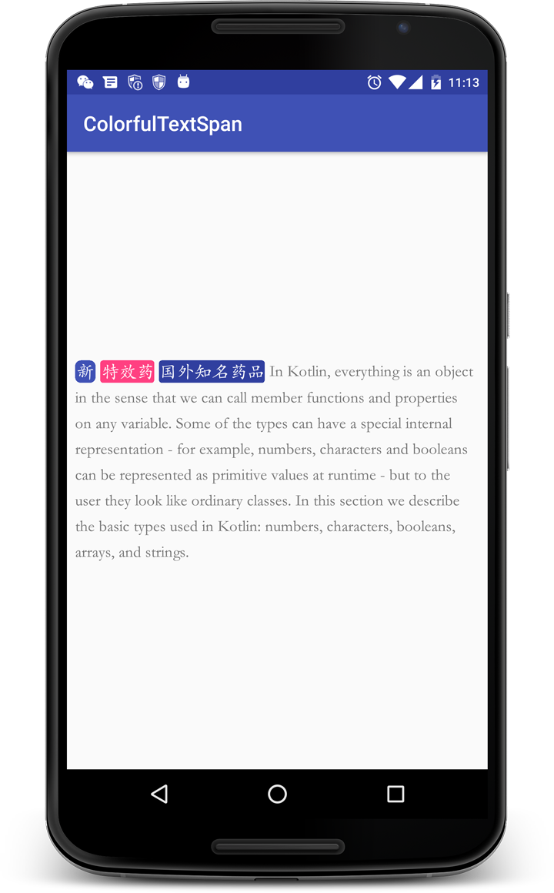

# colorful-text-span


继承自[ReplacementSpan](https://developer.android.com/reference/android/text/style/ReplacementSpan.html)实现

使用方法
1、通过builder构建一个ColorfulTextSpan
```
val b1 = ColorfulTextSpan.Builder(this@MainActivity)
val s1 = b1.backgroundColor(R.color.colorPrimary)
          .texts("新")
          .textColor(android.R.color.white)
          .padding(8)
          .textSize(60f)
          .margin(16)
          .radius(20f)
          .build()
```

2、把实例保存在一个list里

```
spans.add(s1)
```

重复1、2.......

3、遍历设置span,最后给textview设置处理后的span

```
for (i in spans.indices) {
            spannableString.setSpan(spans[i], spannableString.indexOf(spans[i].toString()), spannableString.indexOf(spans[i].toString()) + spans[i].toString().length, Spanned.SPAN_EXCLUSIVE_EXCLUSIVE)
        }
        tv.text = spannableString
```

效果：

